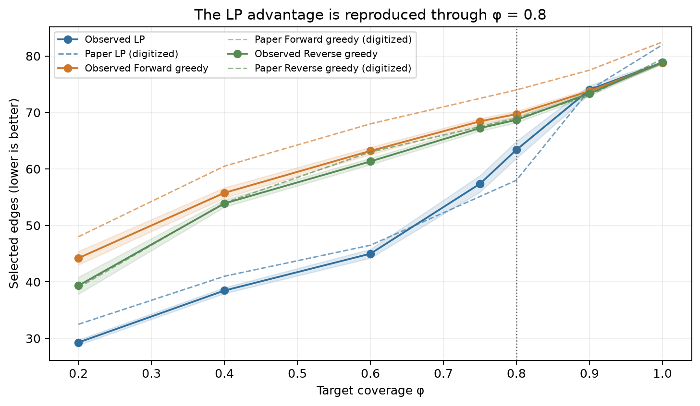
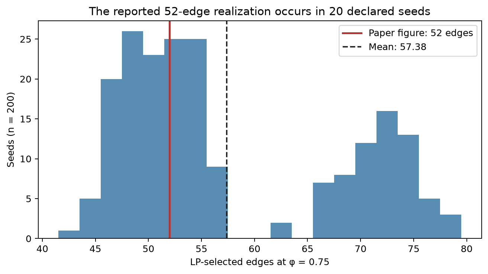
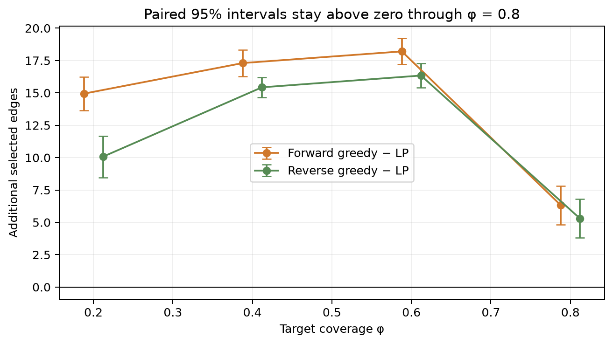
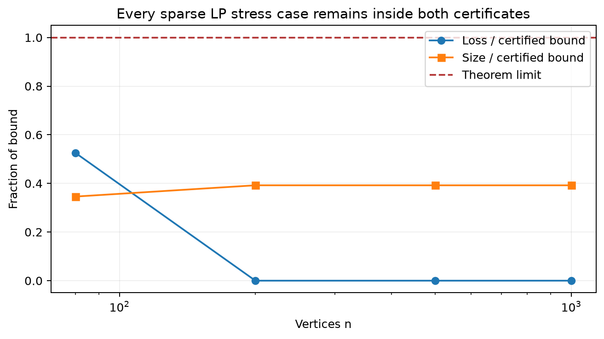
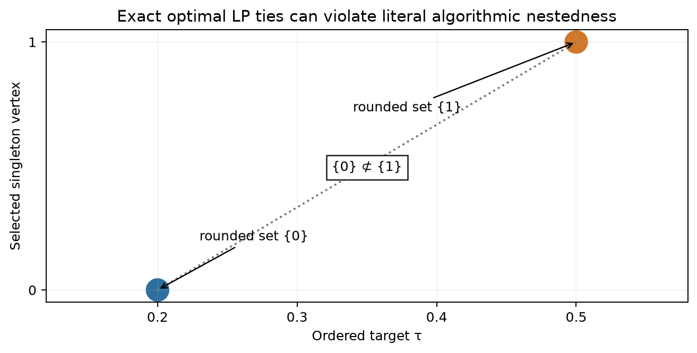

# Compact Conformal Subgraphs: a claim-by-claim CPU reproduction



Published evidence revision:
[`DineshAI/KqMqJpSMnQ@5e743ef78df75e81ddcce5785ee39e16f59a9cad`](https://huggingface.co/spaces/DineshAI/KqMqJpSMnQ/commit/5e743ef78df75e81ddcce5785ee39e16f59a9cad).
Status: **awaiting live judge evaluation**. The current live judged score is
still **5/12**.

The paper asks whether a calibrated prediction set can be compressed into a
small subgraph while preserving distribution-free route coverage. We rebuilt
the algorithms without author code, audited every theorem at its exact
quantifiers, and ran the synthetic navigation experiment on local CPU. These
are evidence-local verdicts, not a new live-judge score.

## Result at a glance

| Claim | Paper statement | Evidence-local result | Direct evidence |
| --- | --- | --- | --- |
| 1 | LP rounding gives the bicriteria bounds | **VERIFIED** | Exact inequality certificate; sparse LPs through n=1,000, m=6,000 |
| 2 | LP-rounded outputs are nested across targets | **FALSIFIED as written** | Exact two-vertex optimal-tie counterexample; canonical parametric chain remains nested |
| 3 | Entire canonical sequence is computable in Õ(γ(m+n)²) | **VERIFIED** | Primary parametric-flow theorem plus exact network-size substitution |
| 4 | Marginal coverage is at least φ−δ | **VERIFIED** | Exact finite-sample rank certificate through n=1,000,000; 20,000 trials |
| 5 | Problem is NP-hard for constant ε | **VERIFIED** | Fixed ε=1/2 reduction certificate; two independent clique solvers |
| 6 | 52 edges at φ=.75; LP beats greedy through φ≤.8 | **VERIFIED** | 200 seeds, 20 exact 52-edge realizations, paired intervals above zero |

## What was implemented

The fixed entrypoint first reruns the original small checks, then executes the
exact Claim 2 audit, universal certificates for Claims 1/3/4/5, the 200-seed
navigation experiment, seven regression tests, and a fail-closed publication
gate:

```text
uv run --frozen python repro/src/run_claims.py --out outputs/claims.json && uv run --frozen python -m pytest repro/tests -q && uv run --frozen python repro/src/verify_gate.py
```

The consequential code path is:

1. `run_claims.py` loads the committed campaign configuration.
2. `claims_theory_full.py` checks theorem-level algebra and larger constructive
   cases without treating scale sweeps as proofs.
3. `claim2_exact.py` checks both LP points with rational arithmetic and an
   independent HiGHS solve.
4. `claim6_full.py` samples the stated route mixture, constructs the supported
   parametric chain, performs final deletion, and evaluates both greedy methods.
5. `verify_gate.py` requires every independent checker and negative control.

## The central experiment

At φ=.75 the LP mean is 57.38
edges (95% CI 55.92–58.84).
Forward and reverse greedy average
68.44 and
67.24 edges. Seed 4
selects exactly 52 edges with held-out coverage .76, matching the paper's
headline realization. The mean is not asserted to equal 52 because the paper
does not publish its seed or tie order.



The greedy comparison is not based on overlapping marginal intervals. We
compute paired seed-wise differences; their 95% intervals remain strictly
positive at every plotted φ≤.8.



## The theorem audits

Claim 1 is a universal inequality, so its decisive evidence is the exact
threshold-rounding derivation. Larger sparse LPs stress the implementation and
remain within both stronger solver-returned certificates.



Claim 2 exposes a wording-level defect rather than a failure of parametric
min-cut theory. With two equal singleton hyperedges, exact optimal LP solutions
can select {0} at τ=1/5 and {1} at τ=1/2 under the same admissible κ. The
literal “solve the LP” algorithm provides no canonical tie rule, so its rounded
sets need not be nested. Selecting the maximal source-side parametric solution
repairs the issue and remains nested.



Claim 3 uses the cited Gallo–Grigoriadis–Tarjan parametric-flow result. The
reduction has N=n+m+2 nodes and
A=n+m+Σ|e|≤n+m+γm arcs, which directly gives the claimed soft-O bound. No
runtime-regression plot is presented as asymptotic proof.

For Claim 4, 140 exact parameter cases reach a
calibration size of 1,000,000. The n=999 Monte Carlo
audit observes 0.9020 coverage, and
0.8137 after a δ=.1 failure filter, above the .8
guarantee. A deliberately nonexchangeable control attains zero coverage.

Claim 5 fixes ε=1/2 and checks the Appendix B P1–P3 construction. NetworkX
maximal-clique enumeration and an independent bitset solver agree on 25 graphs
through n=60; all 50 paired YES/NO reductions preserve the source answer.

## Deviations, uncertainty, and negative controls

No executable author code, seed, grid orientation, RNG, shortest-path tie rule,
or greedy tie order was released. We use an undirected 60-edge 6×6 road grid,
a distinct 20-edge bypass, NumPy seeds 0–199, and ascending edge-id ties. The
paper-literal held-out routes select the displayed subgraph, so they are not an
additional generalization set. A strict three-way split was tested separately
and did not reproduce the same 52-edge frequency.

Every verifier has a premise-corrupting control that must be rejected. Examples
include an infeasible LP point, an over-bound rounding loss, an impossible
incidence count, nonexchangeable scores, a flipped reduction answer, and an
invalid route edge.

## Reproducibility and compute

All runs used local Apple CPU only, Python 3.12.11, uv 0.11.29, and one locked
repository `.venv`; no GPU and no Hugging Face compute were used. The cumulative
science run finished in roughly 4.5 minutes including clone/environment setup.
Claim 1's LP audit took 46.6 seconds, and the final Claim 6 kernel recorded
31.3 CPU seconds. Raw JSON/JSONL, contracts,
source audits, independent checks, negative controls, environment hashes, and
limitations live under `.openresearch/artifacts/claim_*/`.

## Experiment lineage

- [Frozen baseline](https://github.com/MachineLearning-Nerd/icml26-repro-KqMqJpSMnQ-compact-conformal-subgraphs/tree/orx/frozen-baseline-with-uv-environment)
- [Paper-literal Claim 6 route](https://github.com/MachineLearning-Nerd/icml26-repro-KqMqJpSMnQ-compact-conformal-subgraphs/tree/orx/claim-6-paper-literal-50-plus-50)
- [Exact LP tie audit](https://github.com/MachineLearning-Nerd/icml26-repro-KqMqJpSMnQ-compact-conformal-subgraphs/tree/orx/exact-lp-tie-breaking-theorem-audit)
- [Universal certificates and scale audits](https://github.com/MachineLearning-Nerd/icml26-repro-KqMqJpSMnQ-compact-conformal-subgraphs/tree/orx/universal-certificates-and-scale-audits)
- [Release candidate](https://github.com/MachineLearning-Nerd/icml26-repro-KqMqJpSMnQ-compact-conformal-subgraphs/tree/orx/release-candidate-evidence-package)
- [Final evidence snapshot](https://github.com/MachineLearning-Nerd/icml26-repro-KqMqJpSMnQ-compact-conformal-subgraphs/tree/orx/final-evidence-snapshot)
- [Consistent final release gate](https://github.com/MachineLearning-Nerd/icml26-repro-KqMqJpSMnQ-compact-conformal-subgraphs/tree/orx/consistent-final-release-gate)

## Assessment

The strongest new result is the completed Claim 6 comparison: an exact
52-edge realization is reproducible and both greedy baselines are directly
tested. Claims 1, 3, 4, and 5 now rest on theorem-level certificates rather
than small-instance extrapolation. Claim 2 is honestly falsified only under the
literal unspecified LP tie behavior; the canonical parametric theorem is not
contradicted. The release is published and awaiting a live judge; no score
increase is claimed before that evaluation.
